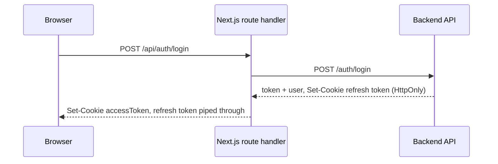
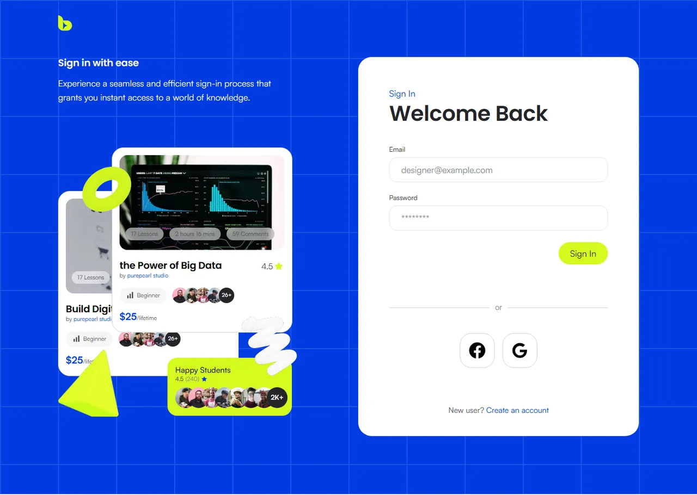
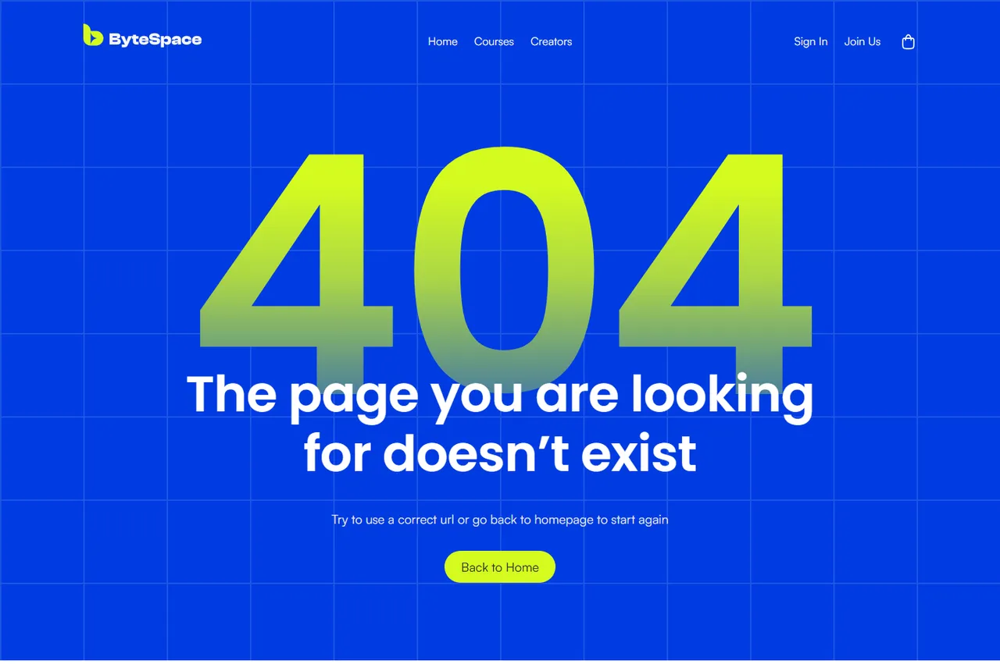

<div align="center">


**Learn, grow and create: an online learning and course marketplace.**

[](https://nextjs.org/)
[](https://react.dev/)
[](https://www.typescriptlang.org/)
[](https://tailwindcss.com/)
[](https://tanstack.com/query)

</div>


## Table of contents

- [About](#about)
- [Features](#features)
- [Tech stack](#tech-stack)
- [Getting started](#getting-started)
- [Environment variables](#environment-variables)
- [Scripts](#scripts)
- [Project structure](#project-structure)
- [Architecture](#architecture)
- [Deployment](#deployment)
- [Conventions](#conventions)
- [Roadmap](#roadmap)
- [Contributing](#contributing)
- [Screenshots](#screenshots)

## About

ByteSpace is the web front end for an online learning platform. Learners discover and take courses; creators publish and manage their own. This repository holds the Next.js app: the marketing homepage, sign-in and sign-up, and the foundations the course catalogue and dashboards build on (data layer, authentication, design system).

The backend is a separate service. Until it is available, the app serves mock data through the same API layer, so every page works straight after `npm install`.

## Features

- **Homepage**: hero with a course search box, featured courses filterable by category, learning paths, testimonials, a creator call to action and a footer with a newsletter form. Responsive from 375px phones to wide desktops. (The search results page and newsletter sign-up are on the [roadmap](#roadmap).)
- **Authentication**: validated sign-in and sign-up forms, a JWT access token in a cookie, an HttpOnly refresh token, silent refresh and session sync across browser tabs. While mock mode is on, the forms run as a demo and send nothing.
- **Route protection**: `proxy.ts` keeps signed-in users off the auth pages and guards the `/student`, `/creator` and `/admin` areas by role.
- **Mock-first data layer**: API services switch between the real backend and mock data with one environment flag. React Query caches responses, and the course section is prefetched on the server so it renders without a loading state.
- **Design system**: the ByteSpace palette, type scale and effects as Tailwind CSS v4 tokens, on top of shadcn/ui and Radix primitives.
- **Motion**: hover micro-interactions, a 3D tilt on section imagery and entrance animations, all switched off when the user prefers reduced motion.
- **Accessibility**: semantic landmarks, labelled controls, visible focus states, and decorative artwork hidden from assistive technology.

## Tech stack

| Area      | Tools                                                                                                                                                           |
| --------- | --------------------------------------------------------------------------------------------------------------------------------------------------------------- |
| Framework | [Next.js 16](https://nextjs.org/) (App Router, Turbopack, React Compiler, standalone output), [React 19](https://react.dev/)                                    |
| Language  | [TypeScript 5](https://www.typescriptlang.org/)                                                                                                                 |
| Styling   | [Tailwind CSS v4](https://tailwindcss.com/), [shadcn/ui](https://ui.shadcn.com/) on [Radix UI](https://www.radix-ui.com/), [Framer Motion](https://motion.dev/) |
| Data      | [TanStack Query v5](https://tanstack.com/query), [Axios](https://axios-http.com/)                                                                               |
| Forms     | [React Hook Form](https://react-hook-form.com/) + [Zod 4](https://zod.dev/)                                                                                     |
| Icons     | [Hugeicons](https://hugeicons.com/), [Lucide](https://lucide.dev/), custom SVGs                                                                                 |
| Tooling   | ESLint 9, Prettier (with the Tailwind plugin), lint-staged config (no Git hook installed yet)                                                                   |
| Delivery  | Vercel (with Speed Insights), or Docker (multi-stage, Node 24 Alpine)                                                                                           |

## Getting started

### Prerequisites

- Node.js **24** (pinned in `package.json`; 20.9+ also works locally)
- npm 10 or later

### Installation

```bash
git clone https://github.com/Redoy0/ByteSpace.git
cd ByteSpace
npm install
cp .env.example .env
npm run dev
```

Open [http://localhost:3000](http://localhost:3000). With `NEXT_PUBLIC_USE_MOCK_API=true` (the default), no backend is needed: course data is mocked, and sign-in and sign-up run as a demo (the forms validate, but nothing is sent).

## Environment variables

Copy `.env.example` to `.env` and adjust as needed. Real `.env` files are git-ignored.

| Variable                                    | Default                                             | Description                                                                                   |
| ------------------------------------------- | --------------------------------------------------- | --------------------------------------------------------------------------------------------- |
| `BACKEND_BASE_URL_DOMAIN`                   | `http://localhost:3000/api`                         | Base URL of the ByteSpace API, used by the Axios client and server-side fetches. Server-only. |
| `NEXT_PUBLIC_APP_URL`                       | Vercel deployment URL, else `http://localhost:3000` | Public URL of this front end, used for metadata and canonical links.                          |
| `NEXT_PUBLIC_USE_MOCK_API`                  | `true`                                              | Serve mock data and run sign-in and sign-up as a demo. Set to `false` to use the backend.     |
| `NEXT_PUBLIC_MAINTENANCE_MODE`              | `false`                                             | Parsed by `envConfig`; reserved for a maintenance screen that is not built yet.               |
| `NEXT_PUBLIC_MAINTENANCE_COUNTDOWN_SECONDS` | `900`                                               | Countdown for the maintenance screen above.                                                   |
| `NEXT_PUBLIC_NODE_ENV`                      | —                                                   | Passed through the Docker build; not currently read by the app.                               |

## Scripts

| Command                                   | Description                                                            |
| ----------------------------------------- | ---------------------------------------------------------------------- |
| `npm run dev`                             | Start the development server (Turbopack) on port 3000, loading `.env`. |
| `npm run build`                           | Create a production build (standalone output, except on Vercel).       |
| `npm run start`                           | Serve the production build, loading `.env`.                            |
| `npm run lint` / `npm run lint:fix`       | Run ESLint, or fix what it can.                                        |
| `npm run typecheck`                       | Type-check the project with `tsc --noEmit`.                            |
| `npm run format` / `npm run format:check` | Format with Prettier, or check formatting.                             |

## Project structure

```text
src/
├── app/
│   ├── (main-layout)/        # Pages with the site navbar and footer (homepage)
│   ├── (auth-layout)/        # Full-screen sign-in and sign-up pages
│   ├── api/auth/             # Route handlers: login, register, logout, refresh-token, session
│   ├── globals.css           # Tailwind v4 theme: design tokens, type scale, utilities
│   ├── layout.tsx            # Root layout: fonts, metadata, providers
│   └── not-found.tsx         # 404 page
├── components/
│   ├── ui/                   # shadcn/ui primitives
│   ├── form/                 # FormWrapper and controlled inputs for React Hook Form
│   ├── icons/                # Custom SVG icons and the ByteSpace mark
│   └── shared/               # App components: navbar, footer, home sections, auth, motion
├── config/envConfig.ts       # Typed access to environment variables
├── constant/                 # Routes and navigation
├── data/                     # Mock data served while the API is in development
├── helpers/api-kit/          # API services, one module per backend domain
├── hooks/                    # React Query hooks and UI hooks
├── lib/                      # Axios client, auth helpers, query options, Zod schemas
├── providers/                # React Query, user session, URL search params
├── services/auth/            # Server actions and token refresh
├── types/                    # Shared TypeScript types
├── utils/                    # Small helpers (JWT decoding, formatting)
└── proxy.ts                  # Route guards (Next.js middleware)
```

## Architecture

### Data flow

```text
helpers/api-kit  →  lib/tanstackQuery/queries  →  hooks  →  components
```

- **API services** (`helpers/api-kit`) are the only place that talks to the backend. Each method checks `envConfig.useMockApi` and returns either mock data (from `src/data`) or the real response, using the same response shape either way.
- **Query options** (`lib/tanstackQuery/queries`) define the cache keys and fetchers once, so server prefetching and client hooks share them.
- **Server prefetch**: sections that need data on first paint prefetch on the server and hand the cache to the client with `<HydrationBoundary>`. See `CourseSection`.

Endpoints the front end expects from the backend:

| Method | Path                                  | Used for                                                                              |
| ------ | ------------------------------------- | ------------------------------------------------------------------------------------- |
| `POST` | `/auth/login`, `/auth/register`       | Returns `{ success, message, token, user }` and sets an HttpOnly refresh-token cookie |
| `POST` | `/auth/refresh-token`, `/auth/logout` | Token rotation and sign-out (the refresh cookie is forwarded)                         |
| `GET`  | `/auth/me`                            | Full profile of the signed-in user                                                    |
| `GET`  | `/courses`, `/courses/:slug`          | Course list (by category, search, page) and course detail                             |
| `GET`  | `/categories`, `/testimonials`        | Homepage content                                                                      |

### Authentication



- Sign-in and sign-up go through Next.js **route handlers**, so the backend's `Set-Cookie` headers reach the browser. The access token is stored in a readable cookie; the refresh token stays HttpOnly.
- The **Axios client** attaches the access token and, on a `401`, refreshes it once through `/api/auth/refresh-token` while queuing other requests.
- **`proxy.ts`** decodes the token on each navigation: it redirects signed-in users away from `/login` and `/register`, and sends visitors to `/login?redirect=…` when they open a role area without the right role. Expired tokens are refreshed silently first.
- **`UserProvider`** exposes the current user through `useUser()`. The root provider seeds it from the JWT on the server, and a `BroadcastChannel` keeps sign-in and sign-out in sync across tabs.
- **Demo mode**: while `NEXT_PUBLIC_USE_MOCK_API` is on, the sign-in and sign-up forms validate and then show a demo notice instead of calling these endpoints (`lib/auth/demoAuth.ts`).

### Styling

- Design tokens live in `src/app/globals.css`: `bs-blue-*`, `bs-lime-*` and `bs-gray-*` scales, `bs-ink` and `bs-navy`, shadows and gradients.
- Text styles are utilities: `typo-heading-{l,m,s,xs}`, `typo-body-{l,m,s,xs}` and `typo-label-{xl,l,m,s,xs}`. Headings use Poppins; body text uses Satoshi.
- Components are server components by default. `"use client"` is added only where there is interactivity.

## Deployment

### Vercel

[](https://vercel.com/new/clone?repository-url=https%3A%2F%2Fgithub.com%2FRedoy0%2FByteSpace)

1. Import the repository in Vercel (**Add New → Project**). The Next.js preset is detected automatically, so the build settings can stay as they are.
2. Add the environment variables from the table above. To deploy the front end on its own, leave `NEXT_PUBLIC_USE_MOCK_API` at `true` (mock data, demo sign-in). Once the backend is live, set it to `false` and point `BACKEND_BASE_URL_DOMAIN` at the API.
3. Deploy. Every push to the production branch redeploys, and other branches get preview URLs.

`NEXT_PUBLIC_APP_URL` can be left empty on Vercel: the app falls back to the deployment's own URL. Set it once you add a custom domain.

[Speed Insights](https://vercel.com/docs/speed-insights) is wired into the root layout; turn it on under the project's **Speed Insights** tab and redeploy to start collecting Core Web Vitals from real visitors.

### Docker

The repository ships a multi-stage `Dockerfile` and a `docker-compose.yml`.

```bash
cp .env.example .env        # set production values
docker compose up --build -d
```

The app listens on port **3300** (set `PORT` to change the host port). `NEXT_PUBLIC_*` values are baked in as placeholders at build time and replaced when the container starts (`entrypoint.sh`), so one image can be promoted across environments.

### Caching

In production, pages are never cached, so a deploy never serves stale HTML. Public images and logos are cached for a day, and hashed build assets for a year. The auth and dashboard routes are marked `noindex`.

## Conventions

- Import from `src` through the `@/` alias.
- New backend calls: add a method to the relevant `helpers/api-kit` module, query options in `lib/tanstackQuery/queries`, and a hook in `hooks/`.
- Forms: `FormWrapper` with the `BS*` inputs from `components/form`, and a Zod schema in `lib/zod`.
- Colours come from the tokens. For border colours write `border-(--bs-gray-200)` rather than `border-bs-gray-200`: Tailwind 4.3 also reads the latter as its logical `border-bs-*` (block-start) utility and colours the top edge with its own grey.
- Put transforms and entrance animations behind `motion-safe:` so they respect reduced-motion settings.

## Roadmap

- [x] Homepage
- [x] Sign-in and sign-up
- [x] 404 page
- [ ] Course catalogue, search results and course detail pages (`/courses`, `/courses/[slug]`)
- [ ] Creator profiles (`/creators`)
- [ ] Student, creator and admin dashboards
- [ ] Social sign-in (Facebook, Google)
- [ ] Newsletter subscription
- [ ] Automated tests and CI

## Contributing

1. Create a branch from `main`, for example `feature/course-detail` or `fix/navbar-focus`.
2. Write commit messages in the [Conventional Commits](https://www.conventionalcommits.org/) style (`feat:`, `fix:`, `refactor:`, `docs:`, `chore:`).
3. Before opening a pull request, make sure these pass:

   ```bash
   npm run typecheck && npm run lint && npm run format:check && npm run build
   ```

4. In the pull request, describe what changed and why, link the related issue, and add screenshots for UI changes.

## Screenshots

| Sign in                                      | 404                                          |
| -------------------------------------------- | -------------------------------------------- |
|  |  |

<details>
<summary>Full homepage</summary>


</details>

---

© 2026 [Redoy0](https://github.com/Redoy0). All rights reserved.
